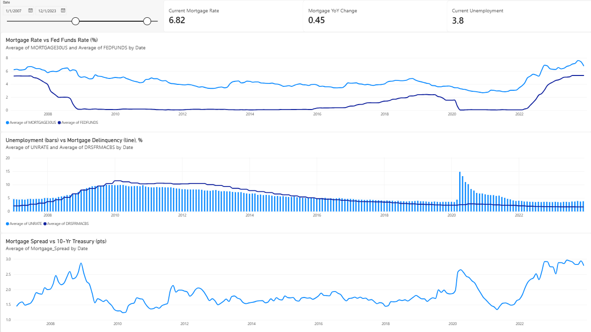

# Mortgage & Economy Dashboard

This project looks at one question: **how do interest rates, inflation, and unemployment affect mortgages?**

I took six public data sets from the Federal Reserve (FRED), cleaned them up in Python, and built a dashboard in Power BI.

*The date slicer is set to 2007–2023.*

## The data

All data comes from [FRED](https://fred.stlouisfed.org).

| Name | What it measures | How often it updates |
|---|---|---|
| MORTGAGE30US | Average 30-year mortgage rate | Weekly |
| FEDFUNDS | The Fed's main interest rate | Monthly |
| DGS10 | 10-year U.S. Treasury yield | Daily |
| UNRATE | Unemployment rate | Monthly |
| CPIAUCSL | Consumer prices (used to get inflation) | Monthly |
| DRSFRMACBS | Share of home loans that are behind on payments | Quarterly |

## What I did to the data

The files update at different speeds, so I put them all on one monthly timeline (`cleaning.ipynb`):

1. Turned daily and weekly numbers into monthly averages.
2. Repeated each quarterly number for all 3 months of that quarter.
3. Calculated **inflation** (how much prices rose compared to a year ago).
4. Calculated the **mortgage spread** (mortgage rate minus the 10-year Treasury yield).
5. Removed October 2025, because the government never published unemployment or price data for that month. I did not want to guess.

**Final result:** one table (`data/fred_clean.csv`) with 427 months, from January 1991 to August 2026.

Note: the newest 4 months of the delinquency number are blank because it comes out late.

## What I found

**1. Mortgage rates went up before the Fed did.**
The 30-year rate rose from 3.10% (Dec 2021) to over 5% by May 2022, when the Fed's rate was still only 0.77%. By Dec 2022 it was 6.36%, up 3.3 points in one year. Mortgage rates follow what people expect the Fed to do, not just what it has already done.

**2. Late mortgage payments usually follow unemployment, but not always.**
Over the whole period the two move together (correlation of 0.70). In the 2008 crisis, unemployment peaked at 10.0% and late payments peaked at 11.48% a few months later. In 2020, unemployment jumped to 14.8%, but late payments only went from 2.35% to 2.84%. Government help programs (like payment pauses and stimulus checks) likely kept people from falling behind.

**3. The mortgage spread got much bigger after 2022.**
From 1991 to 2019 the spread averaged 1.66 points. It reached 2.97 points in June 2023, higher than in 2008 (2.87). By August 2026 it was back down to 1.98. This means part of the high mortgage rates in 2023 came from lenders charging extra for risk, not only from higher Treasury yields.

## Latest numbers (August 2026)

- 30-year mortgage rate: **6.67%** (6.59% a year earlier)
- Unemployment: **4.1%**
- Inflation: **3.35%**
- Fed funds rate: **3.63%**

## Files in this project

| File | What it is |
|---|---|
| `fred-economic-dashboard.pbix` | The Power BI dashboard (open with Power BI Desktop) |
| `cleaning.ipynb` | Python notebook that cleans and combines the data |
| `data/` | The six original FRED files and the final `fred_clean.csv` |
| `dashboard_screenshot.png` | Picture of the dashboard |

## Tools used

Python (pandas), Power BI Desktop, FRED data
